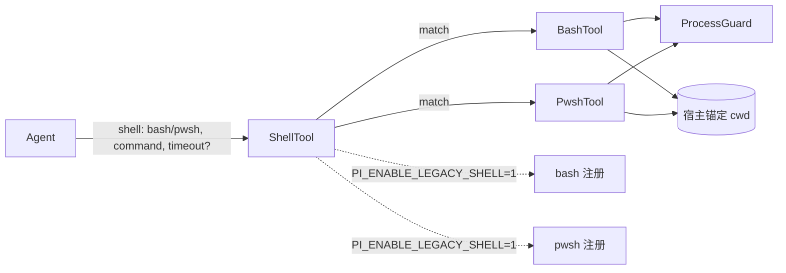

# Single Shell 抽象 — 统一 bash/pwsh 为单一 shell(shell, command) 工具

## 目标与背景

**目标**：将目前暴露给 LLM 的两个独立 shell 工具 `bash` / `pwsh` 向上封装为单一工具 `shell(shell, command, timeout?)`，把平台差异与 `cwd` 锚定下沉到 Rust 层，彻底消除“选错壳 / 方言污染”类错误。

**背景**：

- Windows 上 `cargo`/`rustc`/`clippy` 必须走 `pwsh`（`$PROFILE` 的 `vcvars64`/`sccache`/`lld-link` 懒注入），`bash` 恒 `build-script-build exit 1`。当前靠 `AGENTS.md:25` 文档约束，LLM 仍会选错。
- 双工具暴露让 LLM 带入对方方言：`bash` 方言 `| cat` 在 `pwsh` 中 `cat = Get-Content` 导致 `The input object cannot be bound` 参数绑定失败（已实测触发）。
- `cwd` 由 `BashTool { cwd }` / `PwshTool { cwd }` 在注册时锚定，`run_*_command` 均 `.current_dir(cwd)`，Agent 历来靠 `cd dir && cmd` 解决跨目录。
- 本 Fork 单用户场景，允许默认硬切为单一工具，但要求可逆逃生。

**关联决策**：D52，收口 `D4(bash)` + `D25/D26(vsenv/stdin null)` 的平台分叉；`deliberate` 全景已锁定 11 个节点（见本文 §决策回溯）。

## 决策回溯

| 节点         | 结论                                                              | 关键取舍                                                                                  |
| :----------- | :---------------------------------------------------------------- | :---------------------------------------------------------------------------------------- |
| 统一形态     | 显式 `bash \| pwsh` 必填，**不做 `auto`**                         | 显式可调试 > 省 1 参便利；`auto` 启发式不可靠且破坏排障链路                               |
| 兼容路径     | **默认硬切 A**：对外只暴露 `shell`，`bash`/`pwsh` 默认不注册      | 单用户下列表洁癖 > 过渡期冗余；以 Flag 逃生对冲单点风险                                   |
| 单点兜底     | **C Flag 逃生**：`PI_ENABLE_LEGACY_SHELL=1\|true\|yes` 重启即恢复 | 带外可用（不依赖配置解析），3 行注册分支，不改 `shell` 分发                               |
| 契约护栏     | **极简契约无平台护栏**                                            | 护栏按项目各写各的，不污染通用描述                                                        |
| 护栏落点     | **`tools.toml` 项目覆盖为主**                                     | `[tools.shell] description` 局部加 `cargo→pwsh` 一句，其它项目不跟随                      |
| 实现形态     | **薄转发复用**                                                    | `shell.rs` 仅 `match` 转发到 `BashTool`/`PwshTool`，`ProcessGuard`/`vsenv` 0 重写         |
| Flag 语义    | **环境变量带外开关**，非 `settings.json`                          | 与 `PI_HOSTCALL_*` 风格一致，隔离于 `shell` 分发层                                        |
| 参数完备性   | **无 `workdir`，保留可选 `timeout`**                              | `cwd` 由宿主锚定，跨目录 `cd` 前缀；`timeout` 对齐现有能力不回退                          |
| 描述文案     | **极简中文一句话**，主描述不含截断/timeout 句                     | `timeout` 语义在参数级，不污染主描述                                                      |
| 首个护栏内容 | **先不建 `.pi/tools.toml`，观测 1-2 会话再补**                    | 验证极简自洽后再加 1 行护栏                                                               |
| 验证策略     | **极小面 + 2 单测**                                               | `cargo clippy --lib -- -D warnings && cargo fmt --check && cargo test --lib shell` 为门槛 |

暂缓（📌 待定，不属 V1）：`auto` 自动路由、`workdir` 可选参数、`tools.toml` 首条方言护栏文案。

## 设计总览



- **单一工具列表**：日常 `tools` 仅 `shell` 1 项，上下文 token 变小，`AGENTS.md` 双壳选择说明可删。
- **薄转发**：`shell` 不新增进程管理，保持与现有实现 1:1 行为，bug 面 = 1 个 `match` + 1 个 `enum` 校验。
- **隔离逃生**：`bash.rs`/`pwsh.rs` 保留为未注册内部实现，`PI_ENABLE_LEGACY_SHELL` 分支与 `shell` 分发无共享状态，`shell` 挂时直调底层仍可救。

## 工具契约

**JSON Schema（V1，最小完备）**：

```json
{
  "name": "shell",
  "description": "执行 shell 命令，需显式指定方言。在当前工作目录执行，返回输出文本。",
  "parameters": {
    "type": "object",
    "properties": {
      "shell": {
        "type": "string",
        "enum": ["bash", "pwsh"],
        "description": "方言：bash 或 pwsh"
      },
      "command": {
        "type": "string",
        "description": "要执行的命令"
      },
      "timeout": {
        "type": "integer",
        "minimum": 0,
        "description": "超时秒数，默认 120，0 表示禁用"
      }
    },
    "required": ["shell", "command"]
  }
}
```

**契约要点**：

| 维度          | 约束                                                        | 理由                                                                                            |
| :------------ | :---------------------------------------------------------- | :---------------------------------------------------------------------------------------------- |
| `shell`       | `enum["bash","pwsh"]` **必填**，无默认值                    | 显式方言可调试；方言不互通（`grep/sed/$()` vs `Get-ChildItem`）不能隐藏                         |
| `command`     | `string` 必填                                               | 与现有 `bash/pwsh` 一致                                                                         |
| `timeout`     | `integer` 可选，透传到底层同名逻辑（`None`→120s，`0`→禁用） | 对齐现有能力，长命令（`cargo build`）不误超时；非平台护栏，属执行控制                           |
| `description` | 极简 1 句，不含“超限截断 / timeout 默认值 / 平台护栏”       | 策略按项目各写各的，`timeout` 语义在参数级                                                      |
| `workdir`     | **不提供**                                                  | `cwd` 由宿主锚定，`Agent cwd == shell cwd`；跨目录 `cd dir && cmd` 前缀足够，可逆加法后续按需补 |
| `auto`        | **不提供**                                                  | 启发式路由不可靠；`enum` 新增 `auto` 非破坏性，后续按需加法                                     |

## 实现方案

### 文件与注册

| 文件                 | 动作                             | 说明                                                                                                                                                                                                                                                                                                                                                                                                                                                                                                                                                                                                                                            |
| :------------------- | :------------------------------- | :---------------------------------------------------------------------------------------------------------------------------------------------------------------------------------------------------------------------------------------------------------------------------------------------------------------------------------------------------------------------------------------------------------------------------------------------------------------------------------------------------------------------------------------------------------------------------------------------------------------------------------------------- |
| `src/tools/shell.rs` | **新建** `~30` 行 + 顶部耦合注释 | `ShellInput { shell: String, command: String, timeout: Option<i64> }`，`command.trim().is_empty() => validation("command 不能为空")`，`shell` 非 `bash/pwsh` 时 `Err(validation: Expected shell to be "bash" or "pwsh")`，`timeout <0 => validation`，其余 `Some(v) => Some(v as u64)` 透传；`Tool::name()="shell"`，`execute` 内 `match shell.as_str() { "bash" => BashTool::new(self.cwd.clone()).execute(..., command, timeout, abort) / 静态分发 run_bash_command(&self.cwd, ...) , "pwsh" => PwshTool::new(self.cwd.clone()).execute(...) }`；文件头加注释 `// BashTool/PwshTool::execute 或 run_*_command 签名变更必须同步更新此处 match` |
| `src/tools/bash.rs`  | **保留不删**，不注册             | 内部实现，`#[cfg(test)]` 单测保留，供 `shell` 薄转发与 Flag 逃生复用                                                                                                                                                                                                                                                                                                                                                                                                                                                                                                                                                                            |
| `src/tools/pwsh.rs`  | **保留不删**，不注册             | 同上                                                                                                                                                                                                                                                                                                                                                                                                                                                                                                                                                                                                                                            |
| `src/tools/mod.rs`   | **修改** 3 行                    | `mod shell; pub use shell::ShellTool;`；工具注册处：`registry.add(ShellTool::new(cwd))` 常驻；`if is_legacy_shell_enabled() { registry.add(BashTool::new(cwd)); registry.add(PwshTool::new(cwd)); }`                                                                                                                                                                                                                                                                                                                                                                                                                                            |

**Flag 判定**（与 `PI_HOSTCALL_*` 风格一致）：

```rust
fn is_legacy_shell_enabled() -> bool {
    std::env::var("PI_ENABLE_LEGACY_SHELL")
        .map(|v| matches!(v.trim().to_ascii_lowercase().as_str(), "1" | "true" | "yes" | "on"))
        .unwrap_or(false)
}
```

**执行路径**：`ShellTool { cwd: PathBuf }` 持有宿主锚定 `cwd`，`execute` 内 `&self.cwd.clone()` 借给临时 `BashTool`/`PwshTool` 或静态分发 `run_bash_command(&self.cwd, &command, timeout, abort)`，不重写 `ProcessGuard` / `vsenv` / `resolve_bash_shell` / `.stdin(Stdio::null())` / 截断，全部由既有 `run_*_command` 承载；`shell` 仅传递 `cwd` + `command` + `timeout` + `abort`（`abort` 原样透传至 `wait_with_cancellation`）；`timeout` 校验：`Option<i64>` 接收后 `<0 => validation error`，`None` 透传由底层落 `120s`，`Some(0)` 透传禁用，`Schema minimum: 0` 兜底。

### 文档收口

| 文档                               | 动作                                                                                                                                                         |
| :--------------------------------- | :----------------------------------------------------------------------------------------------------------------------------------------------------------- |
| `docs/context/features.md`         | `bash` + `pwsh` 两条合并为 `shell(shell, command, timeout?) — 统一 shell，显式方言，当前 cwd，薄转发` 单条                                                   |
| `docs/context/conventions.md`      | 反模式补 `双壳选错→收口到 shell` 1 条，或“子进程 stdin 显式 null”旁加注                                                                                      |
| `docs/context/design-decisions.md` | 新增 `D52: 单一 shell 抽象（显式方言 + Flag 逃生）`                                                                                                          |
| `.pi/tools.toml`                   | **V1 不建**，观测期 **1-2 会话或首次出现 `cargo→bash` 选错即补** `[tools.shell] description = "... Windows 上 cargo 用 pwsh ..."` 1 行（回补阈值见注意事项） |

## 改动面清单

| 序号 | 路径 | 类型 | 规模 |
|:-----|:-----|:-----|
| 1 | `src/tools/shell.rs` | 新建 | ~30 行 + `#[cfg(test)]` ~20 行 |
| 2 | `src/tools/mod.rs` | 修改 | + `mod shell` + Flag 分支 3 行 |
| 3 | `src/tools/bash.rs` | 保留 | 0 行改动（不注册） |
| 4 | `src/tools/pwsh.rs` | 保留 | 0 行改动（不注册） |
| 5 | `docs/context/features.md` | 修改 | 1 条合并 |
| 6 | `AGENTS.md` | 修改 | 删双壳说明 + 1 行 Flag |
| 7 | `docs/context/conventions.md` | 修改 | 1 条反模式 |
| 8 | `docs/context/design-decisions.md` | 修改 | 新增 D52 |

无 `Cargo.toml` 依赖新增，无 `forbid(unsafe_code)` 影响，单 `shell` 二进制分发不变。

## 验证策略

**门槛（V1 完成定义）**：

```pwsh
cargo clippy --lib -- -D warnings
cargo fmt --check
cargo test --lib shell -- --nocapture
# 人肉 2 条
# shell(shell="pwsh", command="cargo --version")
# shell(shell="bash", command="echo hi")
```

**新增单测（`src/tools/shell.rs` 末尾 `#[cfg(test)]`）**：

| 用例                              | 断言                                                                                                      |
| :-------------------------------- | :-------------------------------------------------------------------------------------------------------- |
| `shell_forwards_to_pwsh_and_bash` | `shell="pwsh"/"bash"` 分别透传到底层并返回 `is_error==false`（复用 `BashTool`/`PwshTool` 的 `cwd` 注入）  |
| `invalid_shell_rejected`          | `shell="fish"` / `""` / `"Bash"` 大小写返回 `validation: Expected shell to be "bash" or "pwsh"`，不起进程 |
| `timeout_validation`              | `timeout=None→透传120s` / `0→禁用` / `<0→validation` / `string "120" → validation`（`i64` 校验）          |
| `empty_command_rejected`          | `command=""` / `"   "` `trim` 后判空返回 `validation`，不起进程                                           |
| `timeout_forwarded_to_backend`    | `pwsh` 分支收到的 `timeout` 值与输入一致（`Some(60)` 透传为 `Some(60u64)`）                               |

**可选（Flag 分支）**：`PI_ENABLE_LEGACY_SHELL=1` 时 `registry` 含 `bash` + `pwsh` + `shell` 共 3 项的注册断言（若 `registry` 可内省；否则人肉 `PI_ENABLE_LEGACY_SHELL=1 pi --help` 看 `tools` 列表）。

**不做**：集成/`drop-in` 快照/`tools.toml` 覆盖契约测试（`drop-in` 当前 `NOT_CERTIFIED`，单用户薄封装不引入）。

## 兼容与回滚

| 维度              | 策略                                                                                                                                                  |
| :---------------- | :---------------------------------------------------------------------------------------------------------------------------------------------------- |
| 存量调用          | `bash`/`pwsh` 默认不注册，存量模板的 `bash` 调用首轮 `Tool not found` 显性失败；单用户下可一次性全局替换为 `shell(shell="...")`                       |
| 上游 `ci/release` | `tools` 列表由 `1→3` 变 `1` 属加法收口，`ci.yml` 重型 `3 OS × 12 shard` 不校验工具名，`release` 不受影响；`overall_verdict` 保持 `NOT_CERTIFIED` 不变 |
| 回滚              | `set PI_ENABLE_LEGACY_SHELL=1` 后重启 `pi` 即恢复双工具，无需改代码重编译；彻底回滚 = `git revert <shell-commit> && cargo build --release`            |
| 演进兼容          | 后续加 `auto` 或 `workdir` 均为可选参数加法，老 `shell(shell="bash", command="...")` 零破                                                             |

## 演进与扩展

| 演进              | 触发条件                                            | 形态                                                                                                        |
| :---------------- | :-------------------------------------------------- | :---------------------------------------------------------------------------------------------------------- |
| `auto`            | `shell` 上线后统计 `bash` 占比 <5% 且无真实混用管线 | `shell: enum["bash","pwsh","auto"]`，`auto` = 平台默认（`Windows→pwsh, Unix→bash`），**不做命令内容启发式** |
| `workdir`         | 扩展出现频繁跳 `C:/Users/m/other/*` 跨仓批处理      | `workdir?: string` 可选，加 `safe_canonicalize` + 越权校验                                                  |
| `tools.toml` 护栏 | 观测到新会话首条 `cargo` 仍选 `bash`                | `.pi/tools.toml` 加 `[tools.shell] description = "... cargo 用 pwsh ..."` 1 行                              |

📌 以上均为待定，不属 V1。

## 注意事项

- **薄转发是隔离前提**：`shell` 挂只可能是 `enum` 校验/`match` 分发，`bash.rs`/`pwsh.rs` 未动故 Flag 逃生才有效；若在 `shell` 层重写进程管理则隔离失效。
- **当前 `cd` 前缀视为显式授权**：V1 `workdir` 不提供，跨目录靠 `cd dir && cmd` / `cd dir; cmd` 前缀，该前缀不受宿主路径校验约束；后续 `workdir` 加法时补 `safe_canonicalize` 越权校验。
- **`timeout=0` 风险接受**：`timeout=0` 禁用超时 = 显式授权的长阻塞（`sleep 3600` 可永久阻塞），V1 视为受控场景能力，不做 600s 封顶；仅受控场景使用。
- **`description` 极简的代价**：`shell` 主描述不含 `cargo→pwsh`，首轮选错靠失败自纠或后补 `tools.toml`；观测期 **1-2 会话或首次出现 `cargo→bash` 选错即补** `.pi/tools.toml [tools.shell] description` 1 行（阈值已在文档收口明确）。
- **测试隔离**：`cargo test --lib shell` 不编译 `--all-targets` 的 30GB 产物，符合 `AGENTS.md` 日常只跑 `--lib` 约束。

## 待讨论

- [ ] `D52` 文案定稿后，`conventions.md` 反模式措辞是否与 `AGENTS.md` 的 Flag 说明去重
- [ ] `shell` 的 `timeout` 描述是否需补“设 0 禁用”半句（当前 V1 暂保留参数级描述，待观测 LLM 是否需更短）
